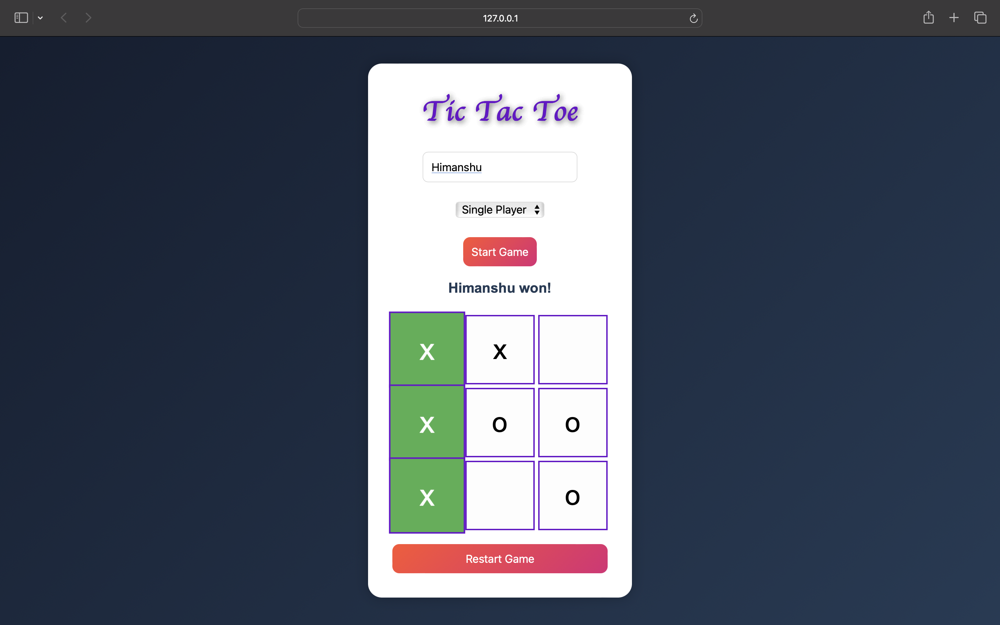

# Tic Tac Toe Game

A modern Tic Tac Toe game built using HTML, CSS and JavaScript.

## Features

- Single Player Mode (AI)
- Multiplayer Mode
- Winner Detection
- Draw Detection
- Winning Animation
- Restart Game Functionality
- Responsive UI

## Technologies Used

- HTML
- CSS
- JavaScript

## Live Demo

https://hi-manshu2301.github.io/Tic-Tac-Toe/

## Screenshot

## How To Run

1. Download the repository
2. Open `index.html`
3. Play the game

## Future Improvements

- Medium AI
- Hard AI
- Sound Effects
- Online Multiplayer
- Scoreboard System